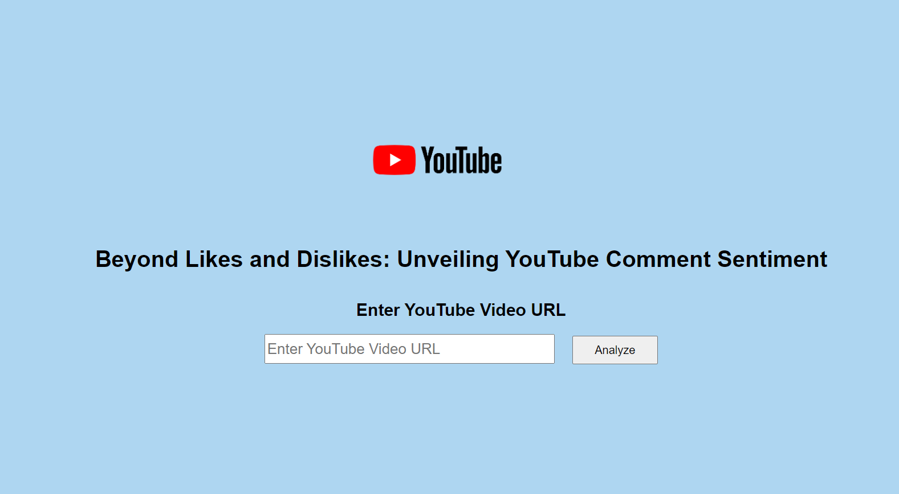
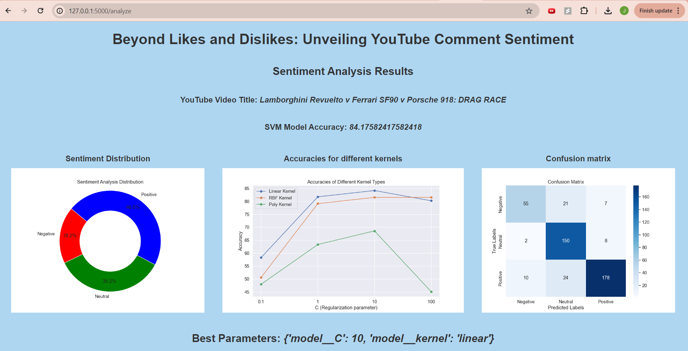

# Beyond Likes and Dislikes: Unveiling YouTube Comment Sentiment

## Introduction
The explosive growth of YouTube has led to vibrant communities around user-generated content, with comments providing valuable insights into viewer sentiments and interactions. Analyzing these comments is beneficial for creators, companies, and researchers by offering a deeper understanding of audience perceptions. Given the informal nature of YouTube comments, which often include slang and emojis, manual analysis is impractical. This project utilizes machine learning, specifically Support Vector Machines (SVM), to automate and accurately classify comment sentiments into positive, negative, or neutral categories.

## Project Overview
- Data Collection: Comments are extracted from YouTube videos using the YouTube Data API.
- Data Preprocessing: Comments are cleaned and prepared, including text normalization and lemmatization.
- Sentiment Analysis: An SVM model is trained to classify comments based on sentiment.
- Evaluation: Model performance is assessed using accuracy, precision, and recall.
- Visualization: Sentiment distribution, kernel accuracy plots, and confusion matrices are generated.

## Source Code Files
- **code/yt_comments_analysis.py**: This module contains functions for extracting YouTube comments, cleaning and preprocessing the comments, training the sentiment analysis model using SVM, and generating visualizations such as sentiment distribution pie chart, kernel accuracy plot, and confusion matrix.
  
- **code/main.py**: This is the main module that runs the Flask web application. It defines routes for the index page and the results page.

- **code/ML_YoutubeComments_analysis.ipynb**: Contains a python notebook format code for comments analysis and model training all incorporated in a single notebook file.

- **templates/index.html**: HTML template for the index landing page. It contains a form for inputting the YouTube video URL.

- **templates/results.html**: HTML template for the results page. It displays the sentiment analysis results, including accuracy, best parameters, and visualizations.

## Setup, Installation and Usage

1. Create a virtual environment `python -m venv yt_sentiment_venv`.
2. Activate the virtual environment \
    On Windows `yt_sentiment_venv\Scripts\activate` \
    On macOS/Linux `source yt_sentiment_venv/bin/activate`
3. Navigate to the `code/` directory and install the dependencies from requirements.txt `pip install -r requirements.txt`.
4. Set the environment variable for the YouTube API key \
    On Windows (Command Prompt): `set YOUTUBE_API_KEY=your_key` \
    On Windows (PowerShell): `$env:YOUTUBE_API_KEY="your_key"` \
    On macOS/Linux: `export YOUTUBE_API_KEY=your_key`
4. Run the Flask application by executing `python main.py`.
5. Access the application in your web browser at `http://localhost:5000`.
6. Input the URL of the YouTube video to analyze and click the submit button.
7. View the sentiment analysis results and visualizations on the results page(it may take few minutes to analyze).

## Output
Landing Page: \

Results Page: \

### Author
Jasdeep Singh Jhajj \
Data Science Graduate (School of Information) \
University of Arizona 

For detailed information, please refer to the yt_sentiment_project.pdf PDF report.